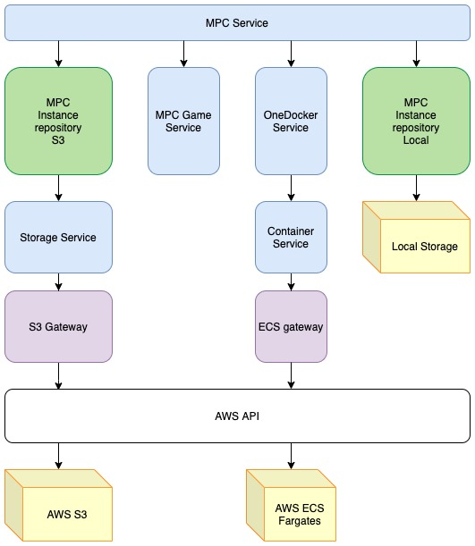

# FBPCS (Facebook Private Computation Service)
FBPCS (Facebook Private Computation Service) is a secure, privacy safe and scalable architecture to deploy MPC (Multi Party Computation) applications in a distributed way on [Amazon ECS](https://aws.amazon.com/ecs). [FBPCF](https://github.com/facebookresearch/fbpcf) is for scaling MPC vertically, while FBPCS is for scaling MPC horizontally. FBPCS consists of various services, interfaces to support various private measurement products, e.g. Private Lift.

[Secure multi-party computation](https://en.wikipedia.org/wiki/Secure_multi-party_computation) (also known as secure computation, multi-party computation (MPC), or privacy-preserving computation) is a subfield of cryptography with the goal of creating methods for parties to jointly compute a function over their inputs while keeping those inputs private. FBPCS provides MPC Service with a scalable and secure computation infrastructure framework so that MPC games can access AWS resources, spin up a large number of defined tasks on Amazon ECS fargate containers, and store necessary big files on Amazon S3.

## Installation Requirements:
### Dependencies for working on Ubuntu 18.04:
* Prerequisites:
    * An AWS account (access_key_id, access_key_data) to use AWS SDK (boto3 API) in FBPCS
    * python3-pip
* Python interpreter:
    * python3.8

## Installing Dependencies on Ubuntu 18.04:
#### Python interpreter
* python3.8
```
sudo apt-get install -y python3.8
```
#### Python module manager
* python3-pip
```
sudo apt-get install -y python3-pip
```
## Installing fbpcs
```
git clone https://github.com/facebookresearch/FBPCS.git
cd FBPCS
sudo python3 pip install -e . --user
```

## Architecture


### Components:
Facebook Private Computation Service follows MVCS( Model View Controller Service) design pattern.
Our PCS design defines the following components:

#### Repository
Repository is responsible for encapsulating database-like operations. In our design, we have MPC instance repositories for both Amazon S3 and local storage. The end point service will call MPC service to create an MPC instance and all the files and information related to this instance will be stored on Amazon S3 or local storage, depending on which repository the end point service is using.

#### Gateway:
Gateway is responsible for encapsulating the interface of dependent services, which is AWS API in our design. Since we need to run tasks on ECS and store files on S3, it is required to call AWS API to do the operations and these api calls reside in the gateways.

#### Mapper:
Mapper deals with data transformation between components. Any response from AWS API calls should be mapped to the data we self defined.

#### Entity:
Entity represents business objects, in our case, the MPC instance, container instance and cluster instance, etc. In our design:

MPC instance contains information about a MPC game. For example, MPC game name, ECS fargate containers running the tasks, etc.

Container instance contains information about a container on an ECS cluster. For example, the instance id, ip address and container status.

Cluster instance contains information about a cluster on the ECS. For example, the Amazon Resource Name (ARN) that identifies the cluster, the cluster name, etc.

VPC contains information abouot a VPC(virtual Private Cloud) on AWS. For example, the VPC id, state, etc.

#### Service:
Service holds all business logic and exposes internal APIs to handlers or internal components within the same code base. In our design:

MPC service provides APIs to endpoint services in order to run a MPC game on Amazon ECS.

Container service will take the advantage of ECS gateway and create instances on Amazon ECS for MPC service or other end-point services to use.

MPC game service will provide MPC service with executable package name and arguments, which the fargate container on ECS will execute in the future.

OneDocker service is responsible for executing executable(s) in a Fargate container. It will generate the commands we input in the bash and trigger the fargate containers to execute the executable(s).

Storage service provides APIs to do CRUD operations on AWS S3 storage.

### Other components in PCS
* /util
   * reflect
   * s3path
   * typing
   * yaml

## License
FBPCS is [MIT](LICENSE) licensed, as found in the LICENSE file.
