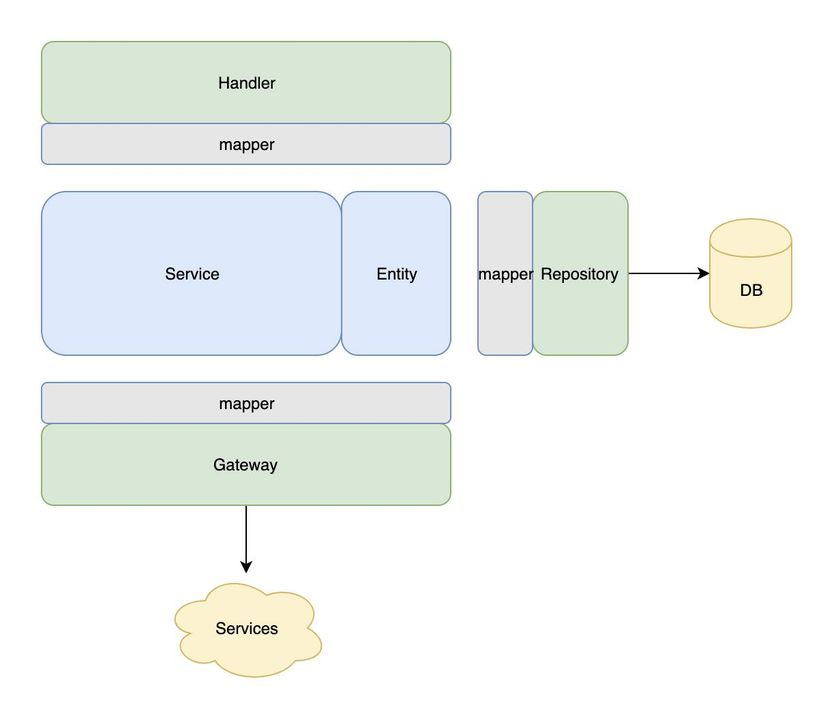

# Why MVCS
MVC was designed for single web application. In this type of app, backend usually exposes only one kind of endpoint which is web/http. In modern SOA or micro service architecture, it becomes more complex. One service may have to support different kinds of endpoints, such as web, mobile, and api (rest/thrift). For each set of endpoints, we need to implement a set of controllers. Code could be duplicated and difficult to manage and maintain. That’s why a new abstraction layer named Service was introduced and MVCS design pattern was defined.

# What is MVCS
MVCS defines the following components.

* Handler: Exposes external endpoints, e.g. XController, GraphAPI, thrift etc. Handlers will address request related issues, like parameter validation, response generation, authentication, authorization, rate limiting, etc. It should not handle any business logic. (e.g. [GraphAPI design principles](https://developers.facebook.com/docs/graph-api/)).
* Repository: Encapsulates database operations.
* Gateway: Encapsulates interface of dependent services.
* Mapper: Deals with data transformation between components, such as thrift object to entity and vice versa.
* Entity: Represents business objects.
* Service: Holds all business logic and exposes internal APIs to handlers or internal components within the same code base. There could be multiple services defined and implemented in this layer.
