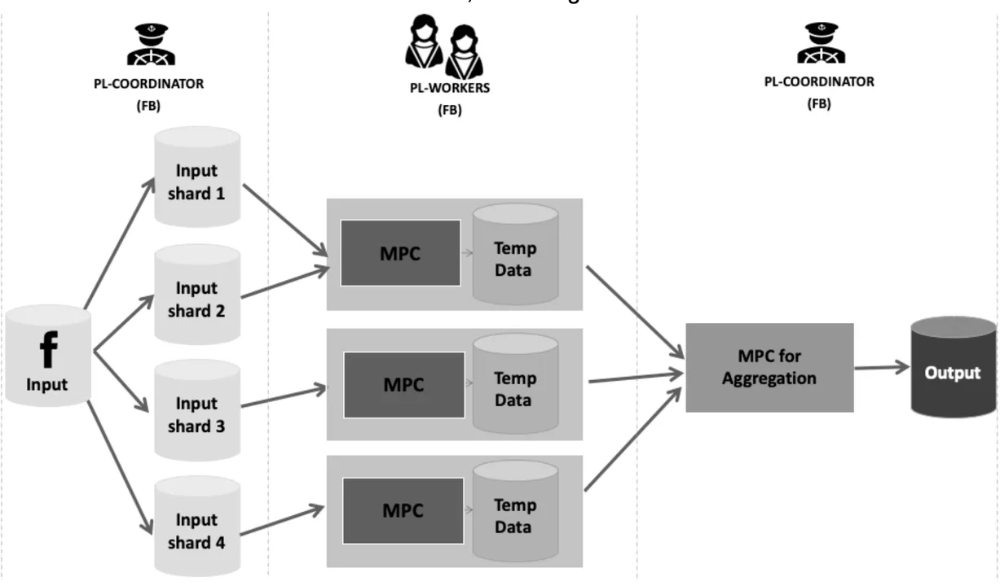

# Introduction
Handling large volumes of data is crucial for products like Private Lift that leverage privacy enhancing technologies including multiparty computation games. Unfortunately, EMP-toolkit and similar MPC platforms cannot handle large enough data sets at the required scale and speed imposed by our product. In this document we go over the design of our solution on how to do sharding on the inputs, without revealing the output of each shard and aggregate the output in a privacy-preserving way such that only the final output will be revealed. As an additional option, we also explain how we can have only one party learn the output and the other party will only participate in the computation without learning any information as the result of the participation.

# Product Requirements
1. Ability to scale horizontally
    1. Our current product requirements require up to 500M rows
    2. EMP-toolkit is limited to 2M row input when we run on the AWS Fargate best option available. (Note: It could be higher when we run on a better machine such as on EC2, however, the scale is limited when using only one machine.)
2. Maintain input privacy and prevent privacy leakage while scaling horizontally, i.e. not revealing the intermediary data.
    1. Product is required to maintain the privacy of the inputs, except that revealed by the lift statistics.
    2. Revealing the lift statistics of each shard would cause privacy leakage, thus we must aggregate sharded results privately.
    3. We require this option to hide the output of the computation from one party.

# Our Protocol
We propose to implement a privacy-preserving sharding mechanism such that the intermediary output of each shard remains private, i.e. the garbled values will not be open to the parties. Instead, each party will learn an XOR share of the value. Consequently, the aggregation step will happen after the data is reconstructed from the XOR-shares in the garbled circuit and only the final result of the computation will be revealed.

## Sharding Design
The following figures show the high-level design of the solution. Both parties have a PL-Coordinator and multiple PL-Workers. The PL-Coordinator partitions the input database into shards in a round robin method, and assigns each shard to a PL-worker.

## Private Partitioning and Aggregation with EMP-toolkit
To ensure that PL-workers will not learn the output of the computation on one shard, we do not reveal the intermediary output at the end of their game. Instead, The server will choose a random number as a new input and XOR the result of the computation with that random number in the garbled circuit (The process also called one-time pad). At the end of the game, the evaluator knows the result of the computation xored with that random number and garbler knows the random number. Jointly, they can reconstruct the result but individually, they do not have any information about it due to the security of one time pads. The following example shows how to implement games for a simple worker and aggregator in EMP (using the reveal function) while preserving privacy. The first game shows how to implement worker without revealing the intermediary result. The second game is the aggregator that accepts the Xored inputs. The third game is the same aggregator with an additional option that reveals the final output to only one party.

#### The worker game outputs XOR results
Put the XOR argument in the reveal function of the game

#### The aggregator game accepts XORed inputs and reveals the output to both parties
The game should xor the inputs before aggregating them.

#### Optional. The aggregator game accepts XORed inputs and reveals the output to only one party

